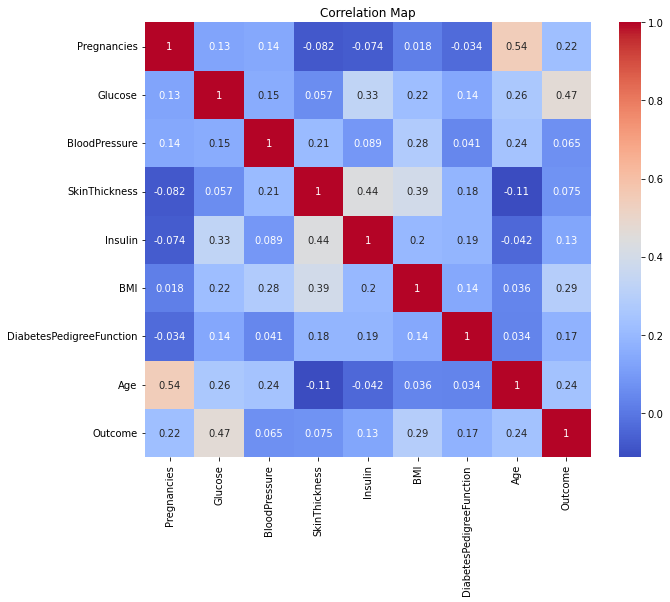
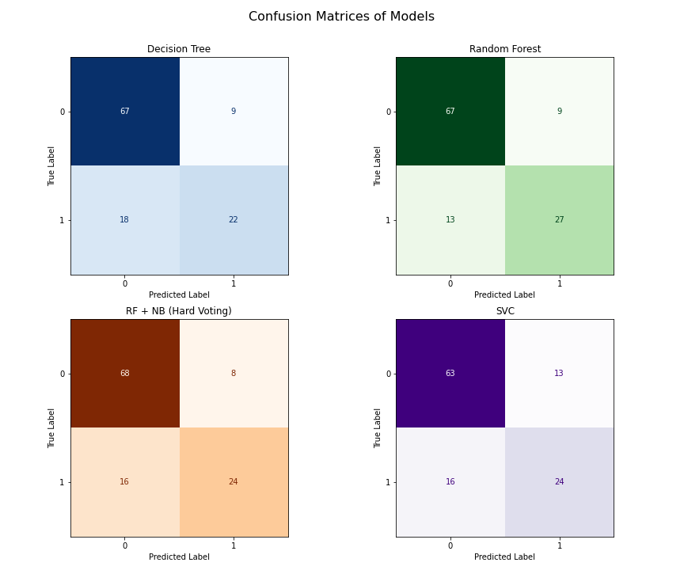

# 🩺 Diabetes Classification Using Machine Learning

This project aims to predict the onset of diabetes in patients using diagnostic measurements from the Pima Indians Diabetes Dataset. We explore multiple classification models and compare their performance with a focus on medically relevant metrics such as **accuracy**, **F1 score**, and **specificity**.

---

## Dataset

- **Source**: [Kaggle - Pima Indians Diabetes Database](https://www.kaggle.com/datasets/uciml/pima-indians-diabetes-database)
- **Records**: 768 samples, 8 features, and 1 target variable
- **Target Variable**: `Outcome` (0: Non-diabetic, 1: Diabetic)

---
## 📁 Project Structure

Diabetes_Mellitus_classification/
│
├── data
│ └── pima_data_diabetes.csv # Raw dataset
│
├── notebooks
│ └── Diabetes_pima.ipynb # Main Jupyter notebook with EDA, modeling, evaluation
│
├── visuals
│ ├── Correlation_heatmap.png # Heatmap showing feature correlations
│ └── confusion_matrices_all.png # Grid of confusion matrices (DT, RF, NB+RF, SVC)
│
├── LICENSE # MIT license file
├── README.md # Project overview and instructions (this file)

##  Models Evaluated

1. **Naive Bayes + Random Forest** (hard voting ensemble)
2. **Random Forest Classifier** (tuned)
3. **Decision Tree Classifier**
4. **Support Vector Classifier** (tuned)

### 📋 Model Comparison

| Model                      | Accuracy | F1 Score | Specificity |
|----------------------------|----------|----------|-------------|
| Naive Bayes + RF (Voting)  | 0.7931   | 0.6667   | 0.8654      |
| Random Forest (Tuned)      | **0.8103** | **0.7105** | **0.8730**  |
| Decision Tree              | ~0.7900   | ~0.6900   | ~0.8500     |
| SVC (Tuned)                | 0.7759   | 0.6667   | ~0.8700     |

---

## Workflow

1. **Data Loading & Inspection**
2. **Exploratory Data Analysis (EDA)**
   - Correlation heatmap
   - Class distribution
3. **Preprocessing**
   - Imputation of missing values
   - Feature selection (based on correlation)
   - Scaling
4. **Model Training & Evaluation**
   - Train-test split
   - Hyperparameter tuning (GridSearchCV)
   - Evaluation metrics: Accuracy, F1 Score, Specificity
5. **Model Comparison & Visualization**

---

## 📊 Visual Insights

### 🔗 Correlation Heatmap

### 📉 Confusion Matrices

---

## 🛠 Technologies Used

- Python
- Jupyter Notebook
- `scikit-learn`
- `pandas`, `numpy`
- `matplotlib`, `seaborn`

---

## 📄 License

This project is licensed under the [MIT License](LICENSE).

---

## Author

**Lasya**  
Interested in Machine Learning & Healthcare Analytics

---

## Future Improvements

- Include additional ensemble strategies (stacking, boosting)
- Test model on external datasets
- Deploy as a simple prediction web app

---

## Key Takeaway

> The tuned **Random Forest model** yielded the best performance with an accuracy of **81%**, F1 score of **0.71**, and specificity of **87.3%**, making it a strong candidate for use in diabetes risk screening systems.

